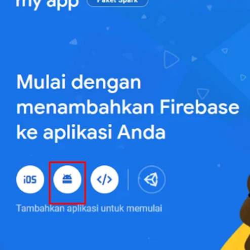
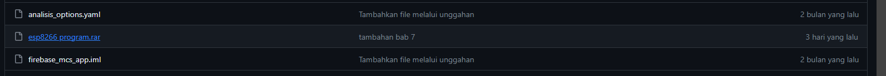
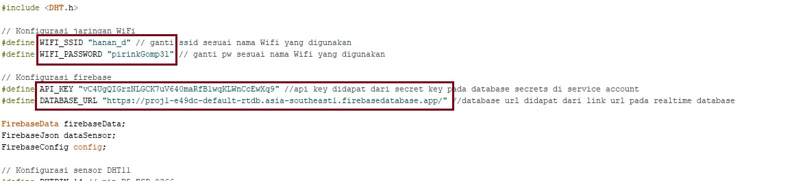
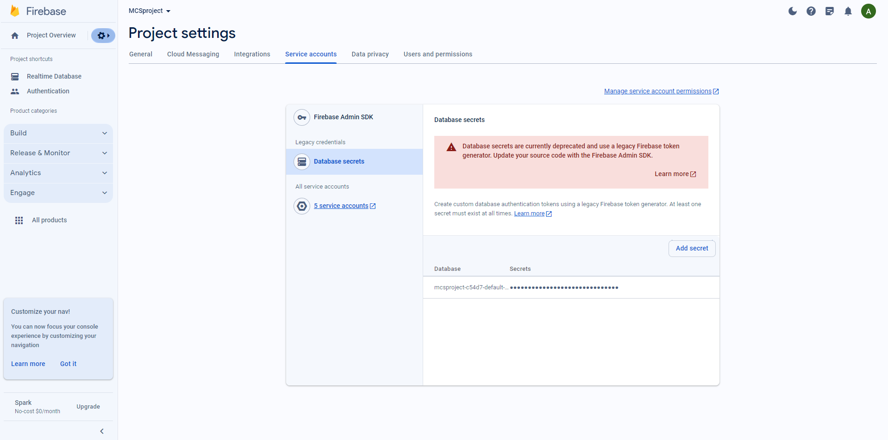
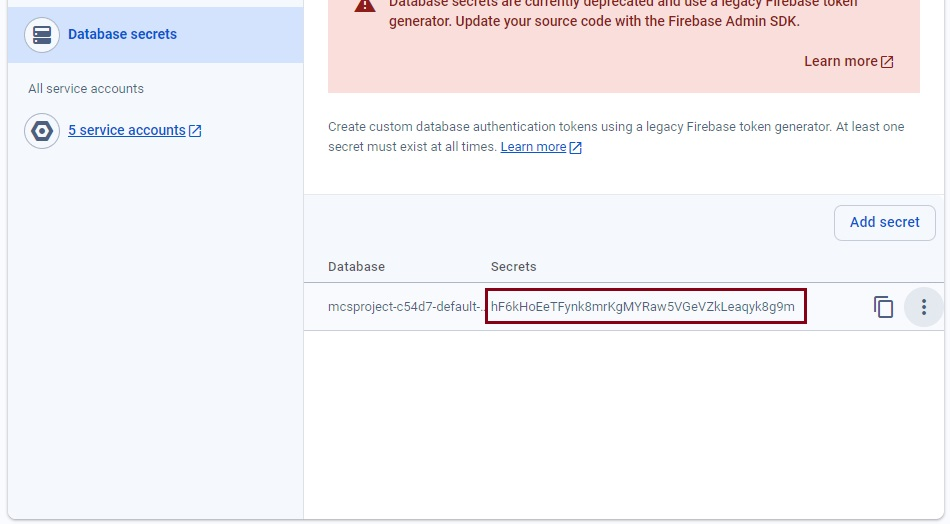
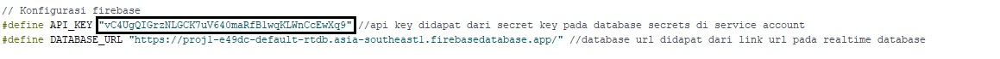
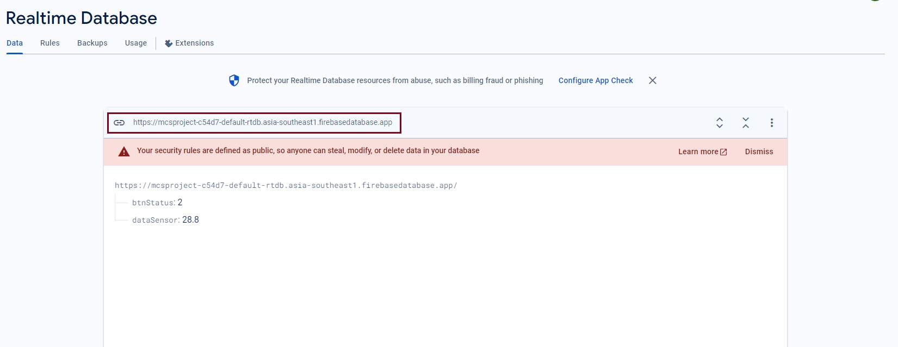
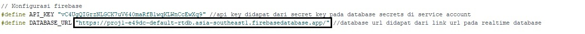

# Bab 7 - Realtime Database dan Mikrokontroler


<a href="https://github.com/muhamadsandi9096">
  
</a>
<a href="https://www.linkedin.com/in/muhamad-sandi-hidayat-330a97260/">
  
</a>
<br/><br/>
<h4 align="right">By Muhamad Sandi Hidayat</h4>
<br/><br/>

## Tujuan
Bab ini akan memberikan panduan langkah demi langkah tentang bagaimana menghubungkan mikrokontroler ESP32 dengan aplikasi Flutter melalui layanan Firebase Realtime Database. Anda akan belajar cara mengirim dan mengambil data antara Mikrokontroler ESP8266 dan aplikasi Flutter menggunakan Firebase sebagai perantara.

## Teori
###	Apa itu Mikrokontroler NodeMCU ESP8266?
Mikrokontroler sendiri merupakan sebuah komputer kecil yang dikemas dalam bentuk chip IC (Integrated Circuit) serta dirancang untuk melakukan tugas maupun operasi tertentu. NodeMCU ESP8266 adalah Microcontroller yang sudah dilengkapi dengan modul WIFI ESP8266 didalamnya, jadi NodeMCU sama seperti Arduino, tapi kelebihannya sudah memiliki WIFI, sehingga Modul ini sangat cocok untuk berbagai aplikasi IoT dan pengembangan prototipe.

###	Apa itu Firebase Realtime Database?
Firebase Realtime Database adalah layanan database cloud yang dapat digunakan untuk menyimpan dan menyinkronkan data secara realtime antara berbagai perangkat. 

###	Cara Menggunakan Firebase
 <p align="center">
  
</p>
Untuk menggunakan Realtime Database pada Firebase, pengguna diharuskan login terlebih dahulu pada halaman firebase,  dan setalah login pengguna tinggal “mulai” saja firebase tersebut. Maka akan diarahkan ke halaman project. Jika belum membuat project pilih “Add Project” untuk menambahkan project baru. 
 <p align="center">
  
</p>
Masukan nama project yang akan dibuat, dan tekan “Create Project”. Maka Project baru tersebut akan dibuat oleh firebase.

 <p align="center">
  
</p>
<p align="center">
  
</p>

Untuk Mengaktifkan Realtime database pada firebase, pada menu pilih Realtime Database. Lalu create Database.
 
 <p align="center">
  
</p>

Pilih lokasi dari database.
 <p align="center">
  
</p>
Dan pilih start in locked mode dan enable.
 <p align="center">
  
</p>
Pada Realtime Database, masuk ke menu rules. Lalu rubah nilai read dan write menjadi “true”. Setelah itu publish.
 <p align="center">
  
</p>
Kembali ke halaman Data pada Realtime Database. Masukan Variabel yang dibutuhkan beserta tipe dari variabel tersebut. Variabel untuk menunjang praktikum bab ini nantinya yaitu “btnStatus” dan “dataSensor”
<p align="center">
  
</p>

## Project Bab 7
Berikut adalah tampilan aplikasi yang akan kita bangun:
<p align="center">
  
</p>
Dari tampilan di atas terdapat text berisi data yang akan diambil dari firebase. Selain itu, terdapat button switch untuk memilih kontrol sistem pada mikrokontroler bekerja secara otomatis atau manual dan button elevated digunakan untuk mengaktifkan/menonaktifkan output dari mikrokontroler ketika ingin mengotrol secara manual.

---

Buatlah project baru dengan nama “firebase_mcs_app” dan pilihlah folder untuk tempat menyimpan project. 
 
 <p align="center">
  
</p>

Dikarenakan aplikasi ini akan dihubungkan dengan firebase realtime database maka di perlukan sebuah library dari firebase tersebut. Buka https://pub.dev/ dan cari firebase_core dan firebase_database.

Tambahkan pada pubspec.yaml didalam blok dependecies :
```dart
    dependencies:
      ...
      
      firebase_core: ^2.14.0
      firebase_database: ^10.2.3
```
Lalu klik pub get atau klik get dependecies untuk menyimpan perubahan tersebut agar ter synchronize.

Tambahkan classpath berikut pada file android/build.gradle.

```dart
dependencies {
        ...
        classpath 'com.google.gms:google-services:4.3.3'
    }
```

Kemudian pada file android/app/build.gradle, tambahkan juga plugin berikut:
```dart
apply plugin: 'com.google.gms.google-services'
```

Masih di file yang sama, rubah  “minSdkVersion flutter.minSdkVersion” pada default config menjadi “minSdkVersion 21”. karena untuk versi dibawah 21, belum ada multidex secara otomatis. Berikut contoh confignya:

```dart
defaultConfig {
        applicationId "com.example.firebase_mcs_app"
        minSdkVersion 21
        targetSdkVersion flutter.targetSdkVersion
        versionCode flutterVersionCode.toInteger()
        versionName flutterVersionName
    }
```

Terakhir pada file android/app/src/main/AndroidManifest.xml tambahkan izin penggunaan internet seperti berikut

```dart
<manifest xmlns:android="http://schemas.android.com/apk/res/android"
    package="com.example.firebase_mcs_app">

    <uses-permission android:name="android.permission.INTERNET" />

...
```
---
###	Menghubungkan flutter App dengan Firebase

Untuk menghubungkan flutter App dengan Firebase, Buka project yang telah dibuat pada firebase. 
 
 <p align="center">
  
</p>

Kemudian ketika pilih menu Android, maka akan diarahkan ke halaman dibawah ini, untuk mengisi beberapa data yang wajib di isi.
 
 <p align="center">
  
</p>

Untuk android package name bisa disesuaikan dengan package name pada AndroidManifest.xml yang letaknya pada android/app/src/main/AndroidManifest.xml atau jika tidak ada dapat dilihat pada build.gradle yang letaknya pada android/app/ build.gradle. Setelah itu isi nama app dan klik Register app.

<p align="center">
  
</p>
 
Selanjutnya  klik download file json,  lalu taruh pada folder android/app/ . Kemudian next sampai selesai proses setup firebase.

<p align="center">
  
</p>

---
### Proses Pembuatan aplikasi

Kembali kedalam Android Studio

Buat file baru dengan nama HomePage pada folder pages didalam folder lib. Jadi supaya lebih tertata, buat folder 'pages' terlebih dahulu didalam folder lib, dan selanjutnya buat file baru tersebut didalam folder 'pages'.

<p align="center">
  
</p>
<p align="center">
  
</p>

Pada folder lib klik kanan dan pilih New -> Directory, masukan nama foldernya yaitu 'pages'. Selanjutnya sama seperti sebelumnya pada folder pages klik kanan dan pilih New -> File, masukan nama filenya yaitu 'homepage.dart'

Kembali ke halaman main.dart,  tambahkan package dari Firebase dan Home Page seperti blok program berikut:

```dart 
import 'package:flutter/material.dart';
import 'package:firebase_core/firebase_core.dart';
import 'package:firebase_mcs_app/pages/homepage.dart';

```

Selanjutnya tambahkan kode berikut pada main.dart (void main) untuk menginisialisasi Firebase:

```dart 
void main() async {
  WidgetsFlutterBinding.ensureInitialized();
  await Firebase.initializeApp();
  runApp(const MainApp());
}
```

Dan didalam class MainApp pada file main.dart, tambahkan kode berikut untuk mengatur default title bar tampilan aplikasi, dan untuk menghubungkan main.dart dengan homepage.dart.

```dart 
class MainApp extends StatelessWidget {
  const MainApp({super.key});

 @override
  Widget build(BuildContext context) {
    return MaterialApp(
      title: 'Firebase MCS App’,
      theme: ThemeData(
          fontFamily: 'Poppins',
          primaryColor: const Color(0xff0597F2),
          appBarTheme: const AppBarTheme(
            centerTitle: true,
            color: Color(0xff0597F2),
            elevation: 0,
          )),
      home: const HomePage(),
    );
  }
}
```

Pada program akan terdapat error/problem pada line HomePage(), itu terjadi karena pada file homepage.dart, memang belum membuat class dengan nama HomePage(). Maka dari itu, buka kembali file hompage.dart.

Tambahkan package dari Material dan Firebase realtime database pada homepage.dart seperti blok program berikut:

```dart 
import 'package:firebase_database/firebase_database.dart';
import 'package:flutter/material.dart';
```

Selanjutnya pada file homepage.dart buat class HomePage dengan Stateful Widget. Dan rubah nama class dengan nama HomePage seperti blok program berikut:

```dart 
class HomePage extends StatefulWidget {
  const HomePage
({super.key});

  @override
  State<HomePage> createState() => _HomePageState();
}

class _HomePageState extends State<HomePage> {
  @override
  Widget build(BuildContext context) {
    return Container();
  }
}
```

Pada class _HomePageState tambahkan program Inisialisasi Variabel untuk menyimpan nilai data dan Database Referance untuk menghubungkan aplikasi dengan path di Firebase Realtime Database:

```dart 
class _HomePageState extends State<HomePage> {
  final databaseReference = FirebaseDatabase.instance.reference();
  int dataValue = 0;
  
...
@override
  void initState() {
    super.initState();
    listenToDataChanges();
  }

  void listenToDataChanges() {
    databaseReference.child('dataSensor').onValue.listen((event) {
      if (event.snapshot.exists) {
        dynamic value = event.snapshot.value;
        if (value is int) {
          setState(() {
            dataValue = value;
          });
        }
      }
    });
  }
```

Selanjutnya tambahkan metode initState() pada program.

```dart 
@override
  void initState() {
    super.initState();
    listenToDataChanges();
  }

  void listenToDataChanges() {
    databaseReference.child('dataSensor').onValue.listen((event) {
      if (event.snapshot.exists) {
        dynamic value = event.snapshot.value;
        if (value is int) {
          setState(() {
            dataValue = value;
          });
        }
      }
    });
  }
```

Penjelasan singkat : 
Jadi initState() adalah metode yang dipanggil saat widget diinisialisasi. Di sini, kita memanggil listenToDataChanges() untuk mendengarkan perubahan pada path 'dataSensor' di database. Jika nilai ada dan berupa integer, nilai dataValue diperbarui dan akan memicu pembaruan UI melalui setState().


Selanjutnya buat program tampilan dari halaman home page seperti di bawah ini.

```dart 
 @override
  Widget build(BuildContext context) {
    return Scaffold(
      appBar: AppBar(
        title: const Text('Firebase MCS App'),
      ),
      body: Center(
        child: Column(
          mainAxisAlignment: MainAxisAlignment.center,
          children: [
            Card(
              elevation: 5, // atur elevasi card sesuai keinginan
              child: Padding(
                padding: const EdgeInsets.all(20.0),
                child: Column(
                  crossAxisAlignment: CrossAxisAlignment.start,
                  children: [
                    Text(
                      'Data Sensor:',
                      style: TextStyle(fontSize: 20),
                    ),
                    Row(
                      mainAxisAlignment: MainAxisAlignment.spaceBetween,
                      children: [
                        Text(
                          '$dataValue °C',
                          style: TextStyle(
                            fontSize: 40,
                            fontWeight: FontWeight.bold,
                          ),
                        ),
                        Row(
                          children: [
                            Text("Auto"),
                            Switch(
                              value: isButtonEnable,
                              onChanged: (value) {
                                setState(() {
                                  isButtonEnable = value;
                                  value ? btncolor = Colors.blue : btncolor = Colors.grey;
                                  value
                                      ? databaseReference.child('btnStatus').set(0)
                                      : databaseReference.child('btnStatus').set(2);
                                });
                              },
                            ),
                            Text("Manual"),
                          ],
                        ),
                        ElevatedButton(
                          onPressed: () {
                            if (isButtonEnable == true) {
                              if (isButtonState == true) {
                                btnOn();
                              } else if (isButtonState == false) {
                                btnOff();
                              }
                            }
                          },
                          style: ElevatedButton.styleFrom(primary: btncolor),
                          child: Text(btnText),
                        ),
                      ],
                    ),
                  ],
                ),
              ),
            ),
          ],
        ),
      ),
    );
  }
```

Pada tampilan aplikasi terdapat sebuah tombol yang digunakan untuk mengaktifkan LED pada mikrokontroler. Maka dari itu diperlukan program kondisi untuk  mengontrol perubahan status tombol dan nilai yang disimpan di Firebase Database.

```dart 
bool isButtonState = true;
  bool isButtonEnable = false;
  var btnText = 'ON';
  Color btncolor = Colors.grey;

  void btnOn() {
    isButtonState = false;
    databaseReference.child('btnStatus').set(1);
    setState(() {
      btnText = 'OFF';
    });
  }

  void btnOff() {
    isButtonState = true;
    databaseReference.child('btnStatus').set(0);
    setState(() {
      btnText = 'ON';
    });
  }

...

```

Penjelasan singkat dari program logic tombol:
•	Variabel ‘isButtonState’ berisi nilai untuk mengontrol apakah tombol saat ini dalam status ON atau OFF. 
•	Variabel ‘isButtonEnable’ berisi nilai untuk mengontrol apakah tombol diizinkan (enabled) atau tidak. 
•	Variabel lainnya digunakan untuk mengatur teks dan warna tombol
•	Metode btnOn() dan btnOff() ini berfungsi mengontrol perubahan status tombol dan nilai yang disimpan di Firebase Database.


## Mengkoneksikan Mikrokontroller ke Firebase

Untuk mengkoneksikan mikrokontroller dengan Firebase, download file "esp8266 program.rar" pada kumpulan folder bab 7 di atas.

<p align="center">
  
</p>

Ekstrak file rar tersebut, lalu buka dan jalankan file pada "esp8266 program\contohProgramArduino\contohProgramArduino.ino". 
<p align="center">
  
</p>
Dalam program mikrokontroller tesebut, ganti nama SSID dan Password dari WiFi yang digunakan oleh kalian. Selain itu, API_KEY dan DATABASE_URL perlu diganti sesuai dengan projek Firebase masing-masing. Berikut Cara mendapatkan API_KEY dan DATABASE_URL:
1. Pada Firebase buka Project Settings -> Service accounts -> Database secrets

<p align="center">
  
</p>
2. Lalu copy token secrets dan paste pada API_KEY didalam program Mikrokontroler.

<p align="center">
  
  <br/><br/>
  
</p>
3. Selanjutnya kembali ke Firebase dan buka Realtime Database. Lalu copy url project tersebut dan paste pada DATABASE_URL didalam program Mikrokontroler.

<p align="center">
  
  <br/><br/>
  
</p>

Setelah merubah SSID, Password, API_KEY, dan DATABASE_URL. Program tersebut sudah bisa diupload kedalam mikrokontroler.

catatan tambahan: 
•	Hubungkan pin 'out' pada sensor DHT 11 ke pin 'D5' pada mikrokontroler esp8266, dan pin '+' & pin '-' pada sensor DHT 11 ke pin '3.3v' dan pin 'gnd' pada mikrokontroler esp8266.
•	Hubungkan pin positif LED ke pin 'D2' pada mikrokontroler esp8266, dan pin negatif LED ke pin 'GND' pada mikrokontroler esp8266.


---
## Laporan Pendahuluan(LP)
1. Berikan penjelasan mengenai Firebase Realtime Database!

2. Jelaskan apa itu Mikrokontroler NodeMCU ESP8266!

## Laporan Akhir(LA)
1. Berikan kesimpulan singkat pada Bab 7!
